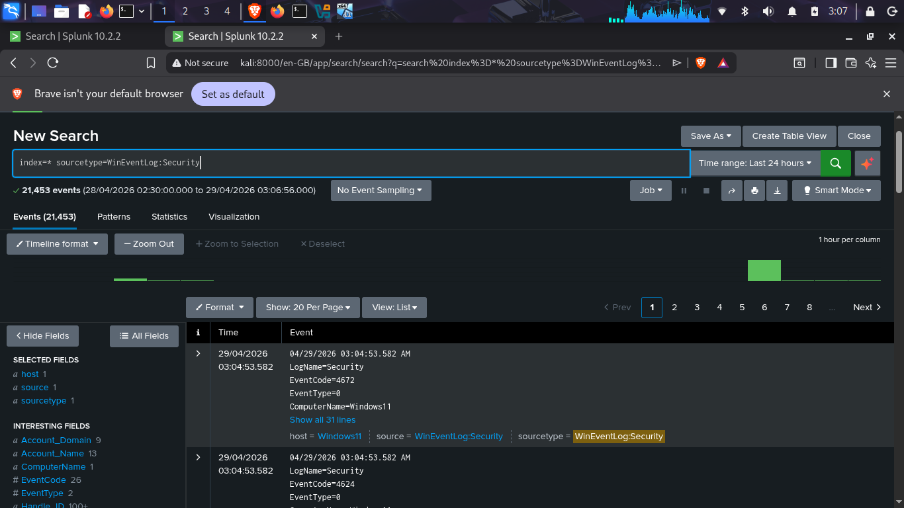
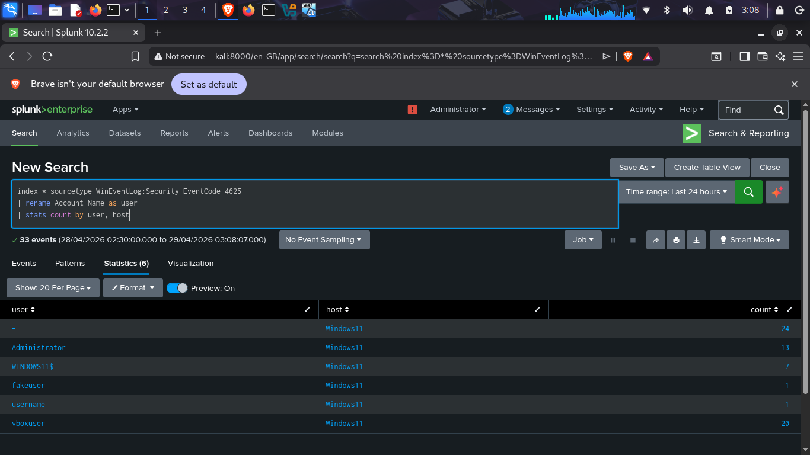
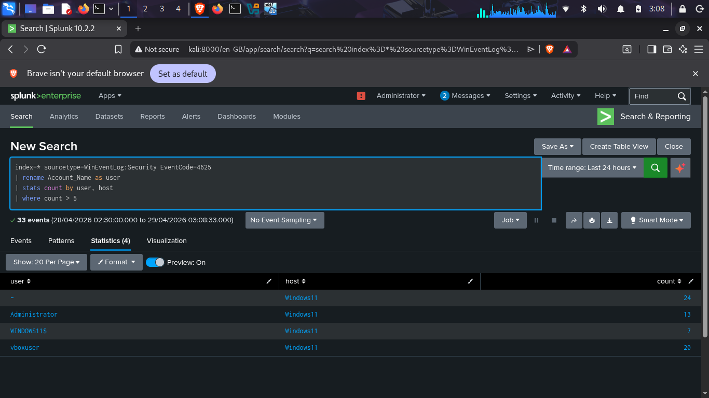

# 🔐 SIEM Log Analysis & Threat Detection (Splunk)

Analyzed Windows Security logs in Splunk to detect brute-force attacks and unauthorized access attempts.

## 🛠 Tools

Splunk Enterprise, Universal Forwarder, Windows 11, Kali Linux

## 🔍 Detection

* Event ID 4625 → Failed logins
* Event ID 4624 → Successful logins
* Detected brute-force when multiple failures were followed by success

## 📸 Screenshots

---

**Author:** Ankesh Kumar
